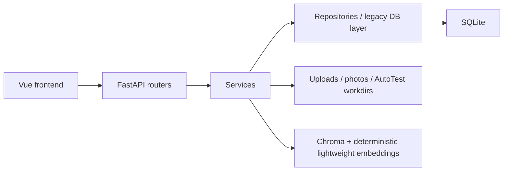

# Architecture

Knowledge Workspace is a local-first FastAPI + Vue + SQLite application.

## Backend

`backend/app/main.py` creates the app through `api/app_factory.py`. Formal routers live in `backend/app/api/routes`; domain handlers live in `backend/app/api/handlers`. `api/legacy_main.py` is a short compatibility shim for older imports and tests.

## Frontend

The Vue app uses typed API helpers in `frontend/src/api.ts` and domain helpers such as `frontend/src/autotest-api.ts`. Shared hand-maintained types remain in `frontend/src/types`, and generated OpenAPI types are written to `frontend/src/api/generated/api-types.ts`.

## Database

SQLite stores documents, knowledge entries, logbook entries, prompts, item links, users, and AutoTest runs. `db/legacy_database.py` now acts as the facade/schema bootstrap, while document, knowledge, logbook, photo, prompt, link, search, dashboard, and AutoTest persistence live behind repository modules.

## AutoTest Flow

ZIP upload -> guarded extraction -> stack detection -> fixed command plan -> simulated or gated real execution -> timeline/report -> optional knowledge/logbook draft.

Real mode requires `AUTOTEST_MODE=real` and `KNOWLEDGE_WORKSPACE_ENABLE_REAL_AUTOTEST=1`.

## Search Flow

Global search returns typed item summaries. The built-in index uses a deterministic lightweight hash embedding so the project stays reproducible in CI and dependency-light local environments. It is useful for demos and stable tests, but it is not a full semantic understanding model. When vector indexing is unavailable, the app falls back further to deterministic keyword-style matching. A real embedding-provider integration would be the path to production-grade semantic search.

## Release Flow

Release packaging copies backend, frontend, scripts, and docs into a temporary tree, builds the frontend, removes runtime artifacts, creates a ZIP, and verifies required docs plus forbidden paths.
