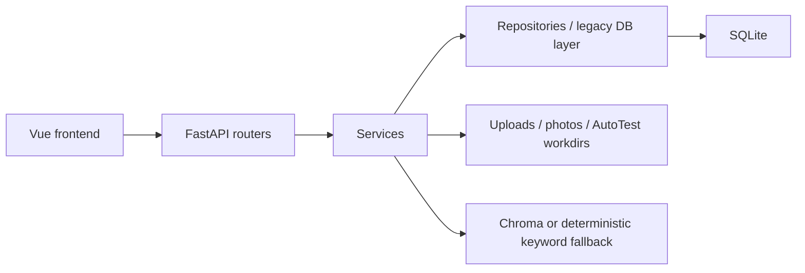

# Architecture

Knowledge Workspace is a local-first FastAPI + Vue + SQLite application.

## Backend

`backend/app/main.py` creates the app through `api/app_factory.py`. Formal routers live in `backend/app/api/routes`. Older handlers still live in `api/legacy_main.py` while migration continues, but route registration now keeps explicit response models.

## Frontend

The Vue app uses typed API helpers in `frontend/src/api.ts` and domain helpers such as `frontend/src/autotest-api.ts`. Shared hand-maintained types remain in `frontend/src/types`, and generated OpenAPI types are written to `frontend/src/generated/api-types.ts`.

## Database

SQLite stores documents, knowledge entries, logbook entries, prompts, item links, users, and AutoTest runs. Dashboard and AutoTest already use focused repositories; broader domain repository extraction is still incremental.

## AutoTest Flow

ZIP upload -> guarded extraction -> stack detection -> fixed command plan -> simulated or gated real execution -> timeline/report -> optional knowledge/logbook draft.

Real mode requires `AUTOTEST_MODE=real` and `KNOWLEDGE_WORKSPACE_ENABLE_REAL_AUTOTEST=1`.

## Search Flow

Global search returns typed item summaries. When vector indexing is unavailable, the app falls back to deterministic keyword-style matching and does not claim true semantic understanding.

## Release Flow

Release packaging copies backend, frontend, scripts, and docs into a temporary tree, builds the frontend, removes runtime artifacts, creates a ZIP, and verifies required docs plus forbidden paths.
