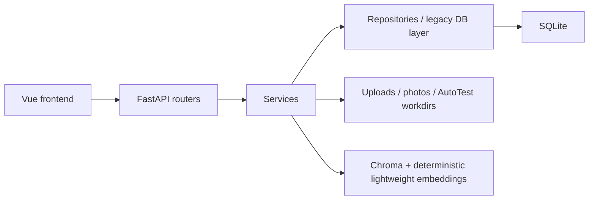

# Architecture

Knowledge Workspace is a local-first FastAPI + Vue + SQLite application.

## Backend

`backend/app/main.py` creates the app through `api/app_factory.py`. Formal routers live in `backend/app/api/routes`; domain handlers live in `backend/app/api/handlers`. `api/legacy_main.py` is a short compatibility shim for older imports and monkeypatch-style tests, not a place for new business logic.

## Frontend

The backend OpenAPI schema is the API contract source of truth. The Vue app uses typed API helpers in `frontend/src/api.ts`, centralized endpoint helpers in `frontend/src/api/endpoints.ts`, generated contract types in `frontend/src/api/generated/api-types.ts`, download helpers in `frontend/src/services/downloads.ts`, and a shared confirmation service in `frontend/src/services/confirm.ts`. `frontend/src/types` should only re-export generated contract types plus UI-only client state types that do not belong in the backend schema.

## Database

SQLite stores documents, knowledge entries, logbook entries, prompts, item links, users, and AutoTest runs. `db/legacy_database.py` now acts as a compatibility facade/schema bootstrap, while document, knowledge, logbook, photo, prompt, link, search, dashboard, and AutoTest persistence live behind repository modules.

## AutoTest Flow

ZIP upload -> guarded extraction -> stack detection -> fixed command plan -> simulated or gated real execution -> timeline/report -> optional knowledge/logbook draft.

Real mode requires `AUTOTEST_MODE=real` and `KNOWLEDGE_WORKSPACE_ENABLE_REAL_AUTOTEST=1`.

The current worker model is intentionally local-first and in-process:

- `/api/autotest/run` persists a queued run, then starts a daemon thread in the backend process
- run status heartbeats use `updated_at` refreshes during execution
- startup recovery marks stale queued/running jobs failed so runs do not stay stuck forever after a restart
- this is not a production-durable queue; a crash can still interrupt active work until RQ/Celery/another external worker is introduced

Real mode is guarded execution, not a true sandbox. For production-style isolation, use:

- container or VM isolation
- non-root execution
- read-only workspace/root filesystem
- network egress restriction
- CPU, memory, and disk quotas
- disposable workspace directories

## Search Flow

Global search returns typed item summaries. The built-in index uses a deterministic lightweight hash embedding so the project stays reproducible in CI and dependency-light local environments. It is useful for demos and stable tests, but it is not a full semantic understanding model. When vector indexing is unavailable, the app falls back further to deterministic keyword-style matching. A real embedding-provider integration would be the path to production-grade semantic search.

## Release Flow

Release packaging copies backend, frontend, scripts, and docs into a temporary tree, builds the frontend, removes runtime artifacts, creates a ZIP, and verifies required docs plus forbidden paths.

## Contract Maintenance

- `docs/openapi.json` is the checked-in backend contract snapshot
- `python scripts/export_openapi.py --check` verifies that snapshot against the FastAPI app using the supported Python 3.11 runtime
- `python scripts/generate_api_types.py --check` verifies `frontend/src/api/generated/api-types.ts`
- frontend JSON APIs should go through `frontend/src/api.ts`; blob/download flows should go through `frontend/src/services/downloads.ts`

## Deprecation Status

`backend/app/api/legacy_main.py` and `backend/app/db/legacy_database.py` are compatibility bridges, not the preferred architecture entrypoints. See `docs/DEPRECATION.md` for the current role and removal conditions.
