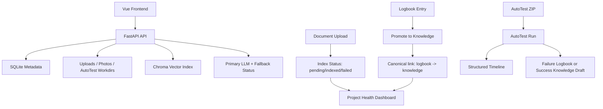

# Knowledge Workspace

Knowledge Workspace is a local-first engineering workspace that combines three product surfaces in one project:

- `Knowledge Workspace`: curated knowledge entries, logbook troubleshooting notes, saved prompts, and related-item links
- `AutoTest`: guarded ZIP / GitHub intake for quick acceptance-style test runs with structured timelines
- `Project Health Dashboard`: real aggregate metrics for knowledge quality, logbook promotion, AutoTest reliability, and document indexing state

## Product Positioning

This repo is built as a portfolio-grade full-stack system rather than a demo CRUD app. The goal is to show:

- consistent data contracts across backend, frontend, and dashboard metrics
- observable background-style workflows with reliable failure states
- testable safety boundaries for file handling and command execution
- clean, auditable architecture with incremental router/service separation

## Core Flow



## Feature Summary

### Knowledge + Logbook

- knowledge lifecycle: `draft -> reviewed -> verified -> archived`
- logbook troubleshooting capture with source refs and related item links
- promote flow now writes the canonical `logbook:{id} -> knowledge:{id}` `produced` link
- compatibility migration keeps old reverse links readable while dashboard metrics use one fixed direction

### AutoTest

- upload `.zip` projects or register GitHub repos for analysis
- simulated mode by default for demos, CI, and safe reproducibility
- real mode is opt-in and uses fixed timeouts, `shell=False`, and sensitive env scrubbing
- backend is now split into:
  - `api/routes/autotest.py`: thin HTTP layer
  - `services/autotest_service.py`: workflow orchestration, timeline, failure handling, cleanup
  - `repositories/autotest_repository.py`: run/step persistence
- run detail includes a timeline with:
  - `Uploaded`
  - `Extracted`
  - `Detected stack`
  - `Installed dependencies / Prepared environment`
  - `Ran tests`
  - `Generated report`
  - `Failed reason`
- any exception after run creation is forced into `failed`, with `failed_reason` persisted

### Project Health Dashboard

- knowledge counts by status
- logbook resolution rate and promoted-to-knowledge count
- AutoTest totals, pass rate, and recent runs
- backend is now split into:
  - `api/routes/dashboard.py`: thin HTTP layer
  - `services/dashboard_service.py`: response composition
  - `repositories/dashboard_repository.py`: SQL-backed metric queries
- document counts based on real DB index state:
  - `pending`
  - `indexed`
  - `failed`
  - `archived`

## Entry Points And Architecture

Primary runtime entrypoints:

- `backend/app/main.py`
- `backend/app/api/app_factory.py`

Transition compatibility layer:

- `backend/app/api/legacy_main.py`
  - still hosts stable document, knowledge, logbook, photo, prompt, auth, and file-serving handlers
  - not the long-term architecture direction

Responsibility split:

- `api/routes/*`: HTTP layer and dependency wiring
- `services/*`: workflow orchestration, safety checks, formatting, and side effects
- `repositories/*`: focused persistence queries/updates
- `db/schema.py` + `db/migrations.py`: database contract and schema evolution

## AutoTest Safety Boundary

AutoTest is intentionally constrained, but it is not a sandbox.

- default mode is `AUTOTEST_MODE=simulated`
- real mode must be explicitly enabled
- real mode executes commands from uploaded projects
- subprocess execution uses `shell=False`
- command timeout is fixed via `AUTOTEST_TIMEOUT_SECONDS`
- real mode strips env vars containing:
  - `TOKEN`
  - `KEY`
  - `SECRET`
  - `PASSWORD`
  - `DATABASE_URL`
- ZIP intake rejects unsafe paths, symlinks, overlarge expansion, and excessive file counts

Recommended usage:

- use `simulated` mode in CI, demos, and shared machines
- use `real` mode only on a local or isolated environment you control
- use `real` mode only with trusted local projects
- recommended future hardening direction:
  - Docker or VM sandboxing
  - no-network execution
  - tighter CPU / memory / file limits

## Local Startup

### Prerequisites

- Python `3.11`
- Node.js `20`

### Backend

```bash
cd backend
python -m pip install -r requirements.txt
python -m pip install -r requirements-dev.txt
```

Set environment variables:

```env
JWT_SECRET=<32+ chars>
DEFAULT_OWNER_PASSWORD=<local password>
ALLOWED_ORIGINS=http://localhost:5173
AUTOTEST_MODE=simulated
# optional: AUTOTEST_MODE=real
# optional: AUTOTEST_TIMEOUT_SECONDS=300
# optional: AUTOTEST_MAX_UNZIPPED_BYTES=262144000
```

Run:

```bash
cd backend
python -m uvicorn app.main:app --host 127.0.0.1 --port 8000 --reload
```

### Frontend

```bash
cd frontend
npm ci
npm run dev -- --host 127.0.0.1 --port 5173
```

## Test And Verification

### Backend

```bash
cd backend
python -m ruff check .
python -m compileall app
python -m pytest -q
```

### Frontend

```bash
cd frontend
npm ci
npm run lint
npm run typecheck
npm run build
npm run test:run
```

If your local default Node runtime is newer than `20`, use a Node 20 runtime for frontend lint/test/build to match CI.

## CI

CI lives in [.github/workflows/ci.yml](.github/workflows/ci.yml) and currently runs:

1. backend dependency install
2. `ruff`
3. `python -m compileall app`
4. `python -m pytest -q`
5. frontend `npm ci`
6. frontend `npm run lint`
7. frontend `npm run typecheck`
8. frontend `npm run build`
9. frontend `npm run test:run`
10. release packaging and smoke checks

## Dashboard Metric Contract

`GET /api/dashboard/health`

Key guarantees:

- `logbook.promoted_to_knowledge` is counted from canonical `logbook -> knowledge` links
- promoted logbooks remain countable even after the source logbook is archived
- `documents.indexed`, `documents.pending`, and `documents.failed_documents` come from persisted document index state, not UI inference
- metrics are scoped to the current authenticated user

Metric sources:

- `knowledge.*`: `knowledge_entries`
- `logbook.*`: `logbook_entries` + canonical `item_links`
- `autotest.*`: `autotest_runs`
- `documents.*`: `documents.index_status`
- `recent_activity.*`: last-7-day slices from the same user-scoped tables

## AutoTest Modes

### `simulated`

- safest default
- no real dependency install or user project command execution
- stable for CI and screenshots

### `real`

- extracts the ZIP
- detects Node/Python project roots
- runs project commands from the uploaded project with constrained subprocess settings
- should only be used on trusted code in an isolated environment

## AutoTest Report Export

- backend endpoints:
  - `GET /api/autotest/{run_id}/export?format=md`
  - `GET /api/autotest/{run_id}/export?format=html`
- frontend run detail exposes:
  - `Download Markdown Report`
  - `Download HTML Report`
  - `Copy AI Fix Prompt`
- HTML export escapes run output and adds a basic CSP meta policy

## AutoTest Timeline Statuses

Each timeline step returns:

- `name`
- `status`
- `started_at`
- `finished_at`
- `duration_ms`
- `message`

Status meanings:

- `pending`: not started yet
- `running`: actively in progress
- `success`: completed successfully
- `failed`: terminal failure at this phase
- `skipped`: intentionally not run because an earlier failure or a safe skip rule applied

## Known Limitations

- `legacy_main.py` still owns part of the document, knowledge, logbook, photo, prompt, and system surface while the migration continues
- AutoTest real mode is constrained subprocess execution, not a hardened sandbox
- GitHub analyze is currently a register/queue flow only: validated URL intake plus queued analysis metadata, not a remote clone-and-run executor
- Chroma emits third-party deprecation warnings in tests
- frontend verification should be run with Node `20` to match CI

## Portfolio Case Study

See [docs/AUTOTEST.md](docs/AUTOTEST.md) for the AutoTest architecture, modes, timeline contract, and safety boundary.

See [docs/PORTFOLIO_CASE_STUDY.md](docs/PORTFOLIO_CASE_STUDY.md) for:

- problem framing
- architecture choices
- major bug fixes
- dashboard contract design
- interview demo script
