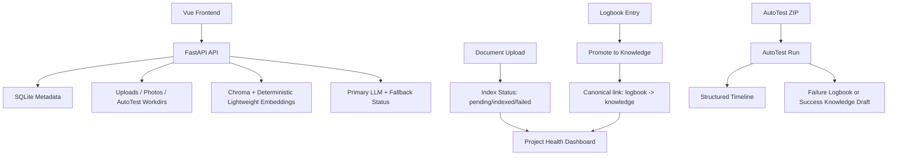

# Knowledge Workspace

Knowledge Workspace is a local-first engineering workspace that combines three product surfaces in one project:

- `Knowledge Workspace`: curated knowledge entries, logbook troubleshooting notes, saved prompts, and related-item links
- `AutoTest`: guarded ZIP / GitHub intake for quick acceptance-style test runs with structured timelines
- `Project Health Dashboard`: real aggregate metrics for knowledge quality, logbook promotion, AutoTest reliability, and document indexing state

## Product Positioning

This repo is built as a portfolio-grade full-stack system rather than a demo CRUD app. The goal is to show:

- consistent data contracts across backend, frontend, and dashboard metrics
- observable background-style workflows with reliable failure states
- testable safety boundaries for file handling and command execution
- clean, auditable architecture with incremental router/service separation

## Core Flow



## Feature Summary

### Knowledge + Logbook

- knowledge lifecycle: `draft -> reviewed -> verified -> archived`
- logbook troubleshooting capture with source refs and related item links
- promote flow now writes the canonical `logbook:{id} -> knowledge:{id}` `produced` link
- compatibility migration keeps old reverse links readable while dashboard metrics use one fixed direction

### AutoTest

- upload `.zip` projects or register GitHub repos for analysis
- simulated mode by default for demos, CI, and safe reproducibility
- real mode is opt-in behind `AUTOTEST_MODE=real` plus `KNOWLEDGE_WORKSPACE_ENABLE_REAL_AUTOTEST=1`, and uses fixed timeouts, `shell=False`, output limits, path sanitization, and sensitive env scrubbing
- backend is now split into:
  - `api/routes/autotest.py`: thin HTTP layer
  - `services/autotest_service.py`: compatibility shim for older imports
  - `services/autotest/service.py`: stable facade used by routers
  - `services/autotest/run_lifecycle.py`: run state transitions and startup recovery
  - `services/autotest/job_executor.py`: background worker flow
  - `services/autotest/report_side_effects.py`: knowledge/logbook draft side effects
  - `services/autotest/workspace_cleanup.py`: temporary workspace cleanup
  - `repositories/autotest_repository.py`: run/step persistence
- run detail includes a timeline with:
  - `Uploaded`
  - `Extracted`
  - `Detected stack`
  - `Installed dependencies / Prepared environment`
  - `Ran tests`
  - `Generated report`
  - `Failed reason`
- any exception after run creation is forced into `failed`, with `failed_reason` persisted

### Project Health Dashboard

- knowledge counts by status
- logbook resolution rate and promoted-to-knowledge count
- AutoTest totals, pass rate, and recent runs
- backend is now split into:
  - `api/routes/dashboard.py`: thin HTTP layer
  - `services/dashboard_service.py`: response composition
  - `repositories/dashboard_repository.py`: SQL-backed metric queries
- document counts based on real DB index state:
  - `pending`
  - `indexed`
  - `failed`
  - `archived`

## Search Reality Check

- the built-in search/indexing path uses Chroma with the deterministic lightweight hash embedding in `backend/app/vector_db.py`
- this is intentionally optimized for local demos, tests, and no-external-dependency environments
- it is not a production-grade semantic understanding model and should not be described as full AI semantic search
- production-grade semantic retrieval would require a real embedding provider such as Ollama embeddings, `sentence-transformers`, or an OpenAI-compatible embedding API
- that provider integration is a roadmap item in the current codebase, not a completed runtime switch

## Entry Points And Architecture

Primary runtime entrypoints:

- `backend/app/main.py`
- `backend/app/api/app_factory.py`

Transition compatibility layer:

- `backend/app/api/legacy_main.py`
  - compatibility shim for older imports and tests
  - stable handlers now live under `backend/app/api/handlers/*` by domain
- `backend/app/db/legacy_database.py`
  - database facade and schema bootstrap
  - focused repository mixins now live under `backend/app/repositories/*`

Responsibility split:

- `api/routes/*`: HTTP layer and dependency wiring
- `services/*`: workflow orchestration, safety checks, formatting, and side effects
- `repositories/*`: focused persistence queries/updates
- `db/schema.py` + `db/migrations.py`: database contract and schema evolution

## AutoTest Safety Boundary

AutoTest is intentionally constrained, but it is not a sandbox.

- default mode is `AUTOTEST_MODE=simulated`
- real mode must be explicitly enabled with both `AUTOTEST_MODE=real` and `KNOWLEDGE_WORKSPACE_ENABLE_REAL_AUTOTEST=1`
- if `AUTOTEST_MODE=real` is set without that enable flag, the API rejects the run
- real mode executes commands from uploaded projects
- Node installs use `npm ci --ignore-scripts --no-audit --no-fund`
- Python dependency installation for uploaded projects is disabled until a stronger trusted sandbox policy is added
- subprocess execution uses `shell=False`
- command timeout is fixed via `AUTOTEST_TIMEOUT_SECONDS`
- `/api/autotest/run` creates an in-process background job; a backend process crash can interrupt an active run until a durable external queue is added
- startup recovery marks stale queued/running AutoTest runs failed after `AUTOTEST_STALE_RUN_MINUTES` (default 30) with a `worker_interrupted: server_restarted` failure reason
- real mode strips env vars containing:
  - `TOKEN`
  - `KEY`
  - `SECRET`
  - `PASSWORD`
  - `DATABASE_URL`
- ZIP intake rejects unsafe paths, symlinks, overlarge expansion, and excessive file counts

Recommended usage:

- use `simulated` mode in CI, demos, and shared machines
- use `real` mode only on a local or isolated environment you control
- use `real` mode only with trusted local projects
- recommended future hardening direction:
  - Docker or Podman sandboxing
  - no-network execution
  - non-root user
  - read-only root filesystem
  - CPU / memory / file-size limits
  - durable job queue
  - persistent logs / timeline

## Local Startup

### Prerequisites

- Python `3.11.x`
- Node.js `20` LTS

### Backend

```bash
cd backend
python -m pip install -r requirements.txt
python -m pip install -r requirements-dev.txt
```

`requirements.txt` contains runtime dependencies only. Install `requirements-dev.txt` for CI-equivalent linting and tests.

Set environment variables:

```env
JWT_SECRET=<32+ chars>
DEFAULT_OWNER_PASSWORD=<local password>
ALLOWED_ORIGINS=http://localhost:5173
AUTOTEST_MODE=simulated
# optional real mode, sandbox/container only:
# AUTOTEST_MODE=real
# KNOWLEDGE_WORKSPACE_ENABLE_REAL_AUTOTEST=1
# optional: AUTOTEST_TIMEOUT_SECONDS=300
# optional: AUTOTEST_MAX_UNZIPPED_BYTES=262144000
```

Run:

```bash
cd backend
python -m uvicorn app.main:app --host 127.0.0.1 --port 8000 --reload
```

### Frontend

```bash
cd frontend
npm ci
npm run dev -- --host 127.0.0.1 --port 5173
```

## Test And Verification

### Backend

```bash
cd backend
py -3.11 -m venv .venv
.venv\Scripts\python -m pip install -r requirements.txt
.venv\Scripts\python -m pip install -r requirements-dev.txt
.venv\Scripts\python -m ruff check ..\backend ..\scripts
.venv\Scripts\python ..\scripts\safe_compileall.py -q ..
.venv\Scripts\python -m pytest -q
.venv\Scripts\python ..\scripts\run_backend_tests.py
```

Python 3.11.x is the supported backend test runtime. Python 3.12/3.13 are not officially supported until dependency constraints are updated. Run `python scripts/check_python_version.py` before backend checks; see `docs/LOCAL_TESTING.md` for the reproducible local flow. CI additionally uses `python scripts/run_backend_tests.py` so backend pytest must both pass and return to the shell.

### Frontend

```bash
cd frontend
npm ci
npm audit --omit=dev --audit-level=high
npm run test:run
npm run lint
npm run typecheck
npm run build
```

Use Node 20.19+ or newer for frontend lint/test/build to match the Vite/Vitest toolchain and CI.

## CI

CI lives in [.github/workflows/ci.yml](.github/workflows/ci.yml) and currently runs:

1. backend dependency install
2. `python scripts/check_python_version.py`
3. `python -m ruff check backend scripts`
4. `python scripts/safe_compileall.py -q .`
5. `python scripts/run_backend_tests.py`
6. `python scripts/export_openapi.py`
7. `python scripts/generate_api_types.py --check`
8. `git diff --exit-code docs/openapi.json frontend/src/generated/api-types.ts`
9. frontend `npm ci`
10. frontend `npm audit --omit=dev --audit-level=high`
11. frontend `npm run test:run`
12. frontend `npm run lint`
13. frontend `npm run typecheck`
14. frontend `npm run build`
15. `python scripts/check_version_consistency.py`
16. `python scripts/package_release.py ./knowledge_workspace_release.zip`
17. `python scripts/verify_release_zip.py knowledge_workspace_release.zip`
18. backend startup plus `python scripts/smoke_check.py --password "OwnerPass123!"`

The release zip is a clean source package. It deliberately excludes `frontend/dist`, `node_modules`, runtime DB/journal files, caches, uploads, and temporary AutoTest/Chroma data; users build frontend assets after extraction with `cd frontend && npm ci && npm run build`.

## Dashboard Metric Contract

`GET /api/dashboard/health`

Key guarantees:

- `logbook.promoted_to_knowledge` is counted from canonical `logbook -> knowledge` links
- promoted logbooks remain countable even after the source logbook is archived
- `documents.indexed`, `documents.pending`, and `documents.failed_documents` come from persisted document index state, not UI inference
- metrics are scoped to the current authenticated user

Metric sources:

- `knowledge.*`: `knowledge_entries`
- `logbook.*`: `logbook_entries` + canonical `item_links`
- `autotest.*`: `autotest_runs`
- `documents.*`: `documents.index_status`
- `recent_activity.*`: last-7-day slices from the same user-scoped tables

## AutoTest Modes

`POST /api/autotest/run` creates an asynchronous job and returns `202 Accepted` with the queued run. The frontend polls `GET /api/autotest/runs/{run_id}` for timeline/log updates and downloads reports only after the run reaches `passed` or `failed`.

### `simulated`

- safest default
- no real dependency install or user project command execution
- stable for CI and screenshots

### `real`

- extracts the ZIP
- detects Node/Python project roots
- requires `KNOWLEDGE_WORKSPACE_ENABLE_REAL_AUTOTEST=1`
- runs a fixed command plan from the uploaded project with constrained subprocess settings
- does not run Python dependency installation for uploaded projects
- should only be used on trusted code in an isolated environment

## AutoTest Report Export

- backend endpoints:
  - `GET /api/autotest/{run_id}/export?format=md`
  - `GET /api/autotest/{run_id}/export?format=html`
- frontend run detail exposes:
  - `Download Markdown Report`
  - `Download HTML Report`
  - `Copy AI Fix Prompt`
- HTML export escapes run output and adds a basic CSP meta policy

## AutoTest Timeline Statuses

Each timeline step returns:

- `name`
- `status`
- `started_at`
- `finished_at`
- `duration_ms`
- `message`

Status meanings:

- `pending`: not started yet
- `running`: actively in progress
- `success`: completed successfully
- `failed`: terminal failure at this phase
- `skipped`: intentionally not run because an earlier failure or a safe skip rule applied

## Known Limitations

- `legacy_main.py` is a compatibility shim for older imports and monkeypatch-based tests; remove it after all callers import concrete route/service modules directly
- AutoTest real mode is constrained subprocess execution, not a hardened sandbox
- AutoTest uses an in-process background worker, not a durable external queue; backend process crashes can interrupt active jobs
- GitHub analyze is currently a register/queue flow only: validated URL intake plus queued analysis metadata, not a remote clone-and-run executor
- built-in vector search uses deterministic lightweight hash embeddings for demos/tests; it is not a production semantic retrieval model
- Chroma emits third-party deprecation warnings in tests
- frontend verification should be run with Node `20` to match CI

## Portfolio Case Study

See [SECURITY_MODEL.md](SECURITY_MODEL.md), [API_CONTRACT.md](API_CONTRACT.md), [TESTING.md](TESTING.md), and [RELEASE_CHECKLIST.md](RELEASE_CHECKLIST.md) for the security, contract, verification, and release rules.

See [docs/AUTOTEST.md](docs/AUTOTEST.md) for the AutoTest architecture, modes, timeline contract, and safety boundary.

See [docs/PORTFOLIO_CASE_STUDY.md](docs/PORTFOLIO_CASE_STUDY.md) for:

- problem framing
- architecture choices
- major bug fixes
- dashboard contract design
- interview demo script
