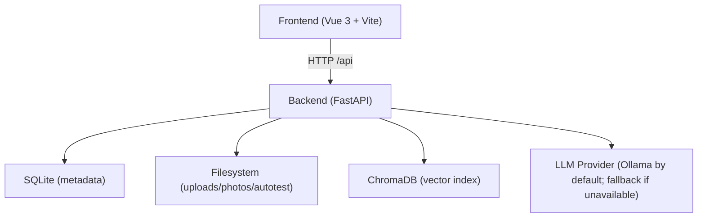

# Knowledge Workspace

Local-first, single-user workspace for engineers to capture troubleshooting knowledge, index docs & screenshots, and retrieve answers with traceable sources.

## Highlights

- **Project Health Dashboard**: a new overview page to monitor system-wide metrics for knowledge, logbook, autotest, and document indexing.
- **Knowledge + Logbook workflow**: draft → reviewed → verified → archived
- **Traceable retrieval**: QA responses include source snippets (documents + notes)
- **Linked items graph**: connect knowledge, logbook, docs, photos, prompts, autotest runs
- **AutoTest ingestion**: upload a project zip, run a basic pipeline, save structured results
- **Clean delivery**: CI runs backend tests + frontend tests/typecheck/build + release zip packaging

## Project Health Dashboard

### API Endpoint
`GET /api/dashboard/health`

Returns a JSON object with various health metrics:
```json
{
  "knowledge": {"total": 0, "by_status": {"draft": 0, "reviewed": 0, "verified": 0, "archived": 0}},
  "logbook": {"total": 0, "with_solution": 0, "promoted_to_knowledge": 0, "resolution_rate": 0.0},
  "autotest": {"total_runs": 0, "passed": 0, "failed": 0, "skipped": 0, "pass_rate": 0.0, "recent_runs": []},
  "documents": {"total": 0, "indexed": 0, "pending": 0, "failedDocuments": 0, "archivedDocuments": 0},
  "recent_activity": {"days": 7, "documents_added": 0, "knowledge_added": 0, "logbook_added": 0, "qa_count": 0, "autotest_runs": 0, "autotest_passed": 0, "autotest_failed": 0}
}
```

### Metrics Sources

- `knowledge`: counts active rows in `knowledge_entries`, grouped by workflow status for the current user.
- `logbook`: counts active rows in `logbook_entries`; `promoted_to_knowledge` only counts current-user links from `logbook:%` to `knowledge:%`.
- `autotest`: summarizes `autotest_runs` for the current user, including pass/fail/skip totals and the five most recent runs.
- `documents`: counts current-user `documents` with `total`, `indexed`, `pending`, `failedDocuments`, and `archivedDocuments`.
- `recent_activity`: counts items created in the last 7 days for the current user.

## Architecture



Notes:
- Vector indexing uses a **lightweight deterministic embedding** implementation for reproducibility in clean environments.
- OCR is optional and controlled by backend env (`OCR_ENABLED`).

## Quick Start (Demo)

Prereqs:
- Python **3.11**
- Node.js **20+**

### 1) Backend

```bash
cd backend
python -m pip install -r requirements.txt
cp .env.example .env
```

Edit `backend/.env` (minimum required):

```env
JWT_SECRET=<32+ chars random>
DEFAULT_OWNER_PASSWORD=<your password>
ALLOWED_ORIGINS=http://localhost:5173
```

Start:

```bash
python -m uvicorn app.main:app --host 0.0.0.0 --port 8000 --reload
```

### 2) Frontend

```bash
cd frontend
npm ci
npm run dev -- --host 0.0.0.0 --port 5173
```

Open:
- `http://localhost:5173`
- Login user id: `owner`
- Password: `DEFAULT_OWNER_PASSWORD`

### 3) Smoke check

```bash
python scripts/smoke_check.py --password "<DEFAULT_OWNER_PASSWORD>"
```

## Configuration (Backend)

All backend paths are resolved consistently via `backend/app/core/config.py`:
- Relative paths are resolved **relative to `backend/`** (not the current working directory).

Health probes:
- `GET /health` (legacy)
- `GET /api/health` (CI + clients)

Key environment variables:
- `JWT_SECRET` (required, **min 32 chars**)
- `DEFAULT_OWNER_PASSWORD` (required to seed initial `owner`)
- `DATABASE_PATH` (default: `documents.db`)
- `UPLOAD_DIR` (default: `uploads/`)
- `MAX_FILE_SIZE` (default: `52428800` bytes = 50MB; enforced by all uploads)
- `PHOTO_DIR` (default: `photos/`)
- `CHROMA_DB_PATH` (default: `chroma_db/`)
- `AUTOTEST_DIR` (default: `autotest_uploads/`)
- `AUTOTEST_MODE` (`real` or `simulated`)
- `ALLOWED_ORIGINS` (comma-separated)
- `OCR_ENABLED` (`true/false/1/0`)
- `OCR_TESSERACT_CMD` (optional absolute path to the `tesseract` binary if not on `PATH`)
- `LLM_PROVIDER` (`ollama`, `mock`, `fallback`)
- `OLLAMA_BASE_URL` (default: `http://localhost:11434`)
- `OLLAMA_MODEL` (default: `llama3.1`)

Text uploads:
- `.txt` / `.md` are accepted and decoded with `utf-8`, `utf-8-sig`, or `cp950` (validation and indexing use the same rules).

## Developer Commands

Backend:

```bash
cd backend
python -m pip install -r requirements-dev.txt
python -m ruff check .
python -m pytest
```

Frontend:

```bash
cd frontend
npm run lint
npm test
npm run typecheck
npm run build
```

Release zip:

```bash
python scripts/package_release.py ./knowledge_workspace_release.zip
```

## AutoTest APIs

Report export:
- `GET /api/autotest/{run_id}/export?format=md`
- `GET /api/autotest/{run_id}/export?format=html`

Run detail contract:
- `GET /api/autotest/runs/{run_id}` always returns `timeline`, even for older sparse runs.
- Each timeline item uses the stable shape `{ key, label, status, timestamp, message }`.
- `status` is limited to `done`, `running`, `failed`, or `pending`.
- Failed runs expose the failure reason in `timeline[].message` when available.

GitHub Analyze:
- `POST /api/autotest/github/analyze`
- This is currently a minimal viable flow: it validates `https://github.com/{owner}/{repo}` and creates a queued/pending AutoTest run.
- It does not pretend the repo has already been cloned or tested.
- When `repo_info.clone_supported` is `false`, the response is explicitly telling clients that clone/exec is not available yet.

## Release Packaging Hygiene

The release zip is built from a clean staging directory and excludes:
- `.git/`
- `node_modules/`
- `__pycache__/`, `.pytest_cache/`, `.pytest-tmp/`, `.pytest-*`
- `backend/uploads/`, `backend/photos/`, `backend/autotest_uploads/`, `backend/chroma_db/`, `backend/.pytest-chroma/`
- any `.env` files, `*.sqlite3`, `*.sqlite`, and `chroma.sqlite3`

## Security Notes

- No default secrets: the backend refuses to start without a real `JWT_SECRET`.
- The initial `owner` account is seeded only when the database is empty and requires `DEFAULT_OWNER_PASSWORD`.
- AutoTest is a **guarded / constrained project runner** for supported stacks (smoke/build/test). It is **not** a fully isolated sandbox.
- AutoTest execution can be forced into `simulated` mode (recommended for CI/demo and reproducible runs).

## Further reading

- `ARCHITECTURE_DECISIONS.md`
