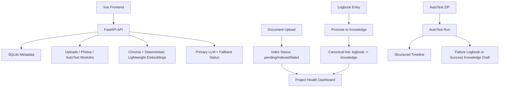

# Knowledge Workspace

Knowledge Workspace is a local-first engineering workspace that combines three product surfaces in one project:

- `Knowledge Workspace`: curated knowledge entries, logbook troubleshooting notes, saved prompts, and related-item links
- `AutoTest`: guarded ZIP / GitHub intake for quick acceptance-style test runs with structured timelines
- `Project Health Dashboard`: real aggregate metrics for knowledge quality, logbook promotion, AutoTest reliability, and document indexing state

## Product Positioning

This repo is intentionally a local-first, single-owner workspace. It is not a public multi-tenant SaaS product, and its auth/session/storage model should be evaluated in that scope.

This repo is built as a portfolio-grade full-stack system rather than a demo CRUD app. The goal is to show:

- consistent data contracts across backend, frontend, and dashboard metrics
- observable background-style workflows with reliable failure states
- testable safety boundaries for file handling and command execution
- clean, auditable architecture with incremental router/service separation

## Core Flow



## Feature Summary

### Knowledge + Logbook

- knowledge lifecycle: `draft -> reviewed -> verified -> archived`
- logbook troubleshooting capture with source refs and related item links
- promote flow now writes the canonical `logbook:{id} -> knowledge:{id}` `produced` link
- legacy reverse `knowledge -> logbook` `derived_from` links stay readable in the query/UI compatibility layer, but new promote writes only the canonical direction

### AutoTest

- upload `.zip` projects or register GitHub repos for intake-only analysis registration
- simulated execution is the safe default for demos, CI, and reproducibility
- "live execution" in this repo means `execution_mode=real`, either through trusted host execution or Docker sandbox execution
- trusted host live execution is opt-in behind `AUTOTEST_MODE=real` plus an explicit enable flag and `AUTOTEST_SANDBOX_BACKEND=local_trusted`
- Docker live execution is available with `AUTOTEST_MODE=docker_sandbox` and uses fixed timeouts, `shell=False`, output limits, path sanitization, artifact logs, network-off-by-default, and Docker CPU/memory flags
- backend is now split into:
  - `api/routes/autotest.py`: thin HTTP layer
  - `services/autotest_service.py`: compatibility shim for older imports
  - `services/autotest/service.py`: stable facade used by routers
  - `services/autotest/run_lifecycle.py`: run state transitions and startup recovery
  - `services/autotest/job_executor.py`: background worker flow
  - `services/autotest/report_side_effects.py`: knowledge/logbook draft side effects
  - `services/autotest/workspace_cleanup.py`: temporary workspace cleanup
  - `repositories/autotest_repository.py`: run/step persistence
- run detail includes a timeline with:
  - `Uploaded`
  - `Extracted`
  - `Detected stack`
  - `Installed dependencies / Prepared environment`
  - `Ran tests`
  - `Generated report`
  - `Failed reason`
- any exception after run creation is forced into `failed`, with `failed_reason` persisted

### Project Health Dashboard

- knowledge counts by status
- logbook resolution rate and promoted-to-knowledge count
- AutoTest totals, pass rate, and recent runs
- backend is now split into:
  - `api/routes/dashboard.py`: thin HTTP layer
  - `services/dashboard_service.py`: response composition
  - `repositories/dashboard_repository.py`: SQL-backed metric queries
- document counts based on real DB index state:
  - `pending`
  - `indexed`
  - `failed`
  - `archived`

## Search Reality Check

- Ollama embedding provider is now available as an optional real semantic embedding provider via `EMBEDDING_PROVIDER=ollama`
- If Ollama is unavailable and fallback is enabled, the system falls back to demo hash embeddings or full-text search
- the built-in fallback search/indexing path uses Chroma with the deterministic lightweight hash embedding in `backend/app/vector_db.py`
- the fallback embedding path is explicitly labeled as a `demo/fallback` provider
- `/api/index/status` reports the current embedding mode: `full_text_only`, `demo_hash_embedding`, `real_semantic_embedding`, or `vector_degraded`
- demo hash embeddings are intentionally optimized for local demos, tests, and no-external-dependency environments
- demo hash embeddings are not a production-grade semantic understanding model and should not be described as full AI semantic search

## Ollama, OpenAI, And OpenAPI

Ollama is optional. If Ollama is not running, the application still starts and the core workspace, knowledge, logbook, docs, and photos features remain available. LLM generation and QA degrade to retrieval-only, unavailable, or no-op fallback behavior depending on the endpoint path.

OpenAI-compatible providers are not enabled as production runtime providers in this release, and no OpenAI API key is required to start or use the project. OpenAPI is the local API contract in docs/openapi.json; it is used for tests and frontend type generation, not as an external AI service.
## Entry Points And Architecture

Primary runtime entrypoints:

- `backend/app/main.py`
- `backend/app/api/app_factory.py`

Transition compatibility layer:

- `backend/app/api/legacy_main.py`
  - compatibility shim for older imports and tests
  - stable handlers now live under `backend/app/api/handlers/*` by domain
- `backend/app/db/legacy_database.py`
  - database facade and schema bootstrap
  - focused repository mixins now live under `backend/app/repositories/*`

Responsibility split:

- `api/routes/*`: HTTP layer and dependency wiring
- `services/*`: workflow orchestration, safety checks, formatting, and side effects
- `repositories/*`: focused persistence queries/updates
- `api/handlers/support.py`: compatibility-only exports for older imports; handlers should import concrete dependencies directly
- `db/schema.py` + `db/migrations.py`: database contract and schema evolution
- `docs/openapi.json`: API contract source of truth
- `frontend/src/api/generated/api-types.ts`: generated frontend types from OpenAPI
- `frontend/src/types/index.ts`: re-export layer plus UI-only client types
- `frontend/src/services/downloads.ts`: shared blob/download helper layer
- `frontend/src/services/confirm.ts`: shared confirm flow for dangerous actions

## AutoTest Safety Boundary

AutoTest is intentionally constrained, but it is not a production-grade sandbox.

- `runner_mode=disabled` means no uploaded project commands will run
- default execution is `AUTOTEST_MODE=simulated`
- trusted host live execution must be explicitly enabled with `AUTOTEST_MODE=real`, `AUTOTEST_SANDBOX_BACKEND=local_trusted`, and either `KW_AUTOTEST_REAL_MODE=1` or `KNOWLEDGE_WORKSPACE_ENABLE_REAL_AUTOTEST=1`
- if trusted host execution is requested without that gate, the API rejects the run before any uploaded command can execute on the host
- trusted host execution runs commands from uploaded projects on the local workspace host
- Docker sandbox mode is enabled with `AUTOTEST_MODE=docker_sandbox`
- Docker sandbox mode uses Docker command execution with timeout, CPU/memory limits, artifact logs, and network disabled by default
- Node installs use `npm ci --ignore-scripts --no-audit --no-fund`
- Python dependency installation for uploaded projects is disabled until a stronger trusted sandbox policy is added
- subprocess execution uses `shell=False`
- command timeout is fixed via `AUTOTEST_TIMEOUT_SECONDS`
- `/api/autotest/run` creates an in-process background job; a backend process crash can interrupt an active run until a durable external queue is added
- the worker refreshes `updated_at` heartbeats during execution, and startup recovery marks stale queued/running AutoTest runs failed after `AUTOTEST_STALE_RUN_MINUTES` (default 30) with a `worker_interrupted: server_restarted` failure reason
- real mode strips env vars containing:
  - `TOKEN`
  - `KEY`
  - `SECRET`
  - `PASSWORD`
  - `DATABASE_URL`
- ZIP intake rejects unsafe paths, symlinks, overlarge expansion, and excessive file counts

Recommended usage:

- use simulated execution with the runner effectively disabled in CI, demos, and shared machines
- use trusted host live execution only on a local or isolated environment you control
- use trusted host live execution only with trusted local projects
- use `docker_sandbox` when Docker is available and you want containerized execution
- enable Docker network only with `AUTOTEST_DOCKER_NETWORK=true` when tests require it
- recommended future hardening direction:
  - Docker or Podman sandboxing
  - disposable workspace per run
  - no-network execution
  - non-root user
  - read-only workspace/root filesystem
  - CPU / memory / disk / file-size limits
  - durable job queue
  - persistent logs / timeline

## First Startup

### Prerequisites

- Python `3.11.x` is required; Python `3.12` / `3.13` are not supported until dependency constraints are updated.
- Node.js `20` LTS with npm `10` or newer is the supported frontend runtime and matches CI.
- The bootstrap scripts create `.venv`, install backend dev dependencies, run `npm ci` in `frontend/`, and create `backend/.env` if missing.
- VS Code users can select `Knowledge Workspace: Full Stack Dev` and press F5 to bootstrap, start FastAPI, start Vite, and open `http://localhost:5173`.
- The repo-root `.env` is documentation/reference only; `backend/.env` is the backend startup file.
- Existing `.env` files are never overwritten.

### Windows

```powershell
.\scripts\bootstrap-dev.ps1
.\scripts\start-dev.ps1
```

### macOS/Linux

Windows bootstrap shortcut:

```powershell
powershell -ExecutionPolicy Bypass -File .\scripts\bootstrap_windows.ps1
```

`backend/requirements.txt` and `backend/requirements-dev.txt` remain committed for pinned/runtime visibility, while the supported local verification flow uses `pip install -e ".[dev]"` from the repo root.

Set environment variables:

```env
JWT_SECRET=<32+ chars>
DEFAULT_OWNER_PASSWORD=<local password>
ALLOWED_ORIGINS=http://localhost:5173
AUTOTEST_MODE=simulated
# trusted host live execution:
# AUTOTEST_MODE=real
# KNOWLEDGE_WORKSPACE_ENABLE_REAL_AUTOTEST=1
# AUTOTEST_SANDBOX_BACKEND=local_trusted
# docker live execution:
# AUTOTEST_MODE=docker_sandbox
```

Run:

```powershell
cd backend
python -m uvicorn app.main:app --host 127.0.0.1 --port 8000 --reload
```

### Frontend
### macOS/Linux

```bash
bash scripts/bootstrap-dev.sh
bash scripts/start-dev.sh
```

Default development URLs:

- Backend API: `http://127.0.0.1:8000`
- API Docs: `http://127.0.0.1:8000/docs`
- Frontend: `http://127.0.0.1:5173`

Frontend API base behavior:

- Local dev can use `VITE_API_BASE=http://127.0.0.1:8000`; the VS Code F5 frontend task sets this explicitly.
- If `VITE_API_BASE` is not set, the frontend uses same-origin `/api`. Vite dev server proxies `/api` to `http://localhost:8000`, and production builds will call the same host that serves the frontend.
- For same-origin deploys, leave `VITE_API_BASE` unset and route `/api` to the backend at the reverse proxy or platform layer.
- For static hosting on a separate domain, set `VITE_API_BASE` at build time to the public backend origin, for example `VITE_API_BASE=https://api.example.com`. Do not rely on a localhost default in production.

VS Code F5:

- Use the compound launch profile `Knowledge Workspace: Full Stack Dev`.
- F5 runs `bootstrap: dev`, starts FastAPI with `${workspaceFolder}\.venv\Scripts\python.exe`, starts Vite with `npm.cmd`, and opens Edge at `http://localhost:5173`.
- The F5 frontend task sets `VITE_API_BASE=http://127.0.0.1:8000` so local demo startup remains explicit.

### Environment Files

Bootstrap writes safe local defaults only when files are missing:

- `backend/.env` is the authoritative backend startup env file
- `.env` at the repo root is reference-only and should not override `backend/.env`
- both templates use backend-relative paths such as `./documents.db` to avoid `backend/backend/...` nesting

AutoTest real mode stays off in both files:

```env
AUTOTEST_MODE=simulated
KW_AUTOTEST_REAL_MODE=0
KNOWLEDGE_WORKSPACE_ENABLE_REAL_AUTOTEST=0
AUTOTEST_SANDBOX_BACKEND=disabled
```

### AutoTest Runner Modes

Use these terms consistently:

- `runner disabled`: `runner_mode=disabled`, no uploaded project commands run
- `simulated execution`: `execution_mode=simulated`, safe default
- `live execution`: `execution_mode=real`, actual commands run via trusted host or Docker

Trusted host live execution is disabled by default because it executes commands from uploaded projects on the local host. Use it only for trusted local projects; do not run untrusted ZIP uploads.

To enable trusted host live execution:

```env
AUTOTEST_MODE=real
KW_AUTOTEST_REAL_MODE=1
AUTOTEST_SANDBOX_BACKEND=local_trusted
```

To enable Docker live execution:

```env
AUTOTEST_MODE=docker_sandbox
AUTOTEST_DOCKER_IMAGE=python:3.11-slim
AUTOTEST_DOCKER_NETWORK=false
AUTOTEST_DOCKER_MEMORY=2g
AUTOTEST_DOCKER_CPUS=2
```

## Embedding And Search Modes

Document upload writes full-text search content before vector indexing. If ChromaDB or an embedding provider is unavailable, upload can still succeed and the API reports a degraded semantic index instead of a fatal upload failure.

```env
EMBEDDING_PROVIDER=demo_hash
EMBEDDING_MODEL=nomic-embed-text
EMBEDDING_BASE_URL=http://localhost:11434
EMBEDDING_TIMEOUT_SECONDS=5
EMBEDDING_FALLBACK_ENABLED=true
```

Set `EMBEDDING_PROVIDER=ollama` to use Ollama embeddings. If Ollama is not running and fallback is enabled, the backend falls back to deterministic demo hash embeddings. `GET /api/index/status` reports `full_text_only`, `demo_hash_embedding`, `real_semantic_embedding`, or `vector_degraded`.

## Test And Verification

Windows:

```powershell
.\scripts\verify-all.ps1
```

macOS/Linux:

```bash
bash scripts/verify-all.sh
```

The verification scripts reuse the existing CI-equivalent Python gate (`scripts/verify_all.py`) and stop on the first failing stage.

### Backend Checks

```powershell
.\.venv\Scripts\python.exe scripts\check_text_encoding.py
.\.venv\Scripts\python.exe scripts\check_python_version.py
.\.venv\Scripts\python.exe scripts\audit_python.py
.\.venv\Scripts\python.exe scripts\safe_compile.py -q .
.\.venv\Scripts\python.exe -m ruff check backend scripts
.\.venv\Scripts\python.exe scripts\run_backend_tests.py
.\.venv\Scripts\python.exe scripts\check_index_consistency.py
.\.venv\Scripts\python.exe scripts\export_openapi.py
.\.venv\Scripts\python.exe scripts\generate_api_types.py --check
.\.venv\Scripts\python.exe scripts\check_version_consistency.py
```

Python `>=3.11,<3.12` is the supported backend test runtime. Do not use Python 3.13 for this project; dependency constraints and CI are pinned to Python 3.11. Run `python scripts/check_python_version.py` before backend checks; see [docs/LOCAL_BACKEND_VERIFY.md](docs/LOCAL_BACKEND_VERIFY.md) and `docs/LOCAL_TESTING.md` for the reproducible local flow. CI additionally uses `python scripts/run_backend_tests.py` so backend pytest must both pass and return to the shell.

If dependency installation fails with a `TOMLDecodeError` at line 1 column 1, run `python scripts/check_text_encoding.py` first. The encoding gate checks repository text files, including `.txt`, `requirements.txt`, TOML, Vue, TypeScript, JSON, YAML, and env templates, and fails on UTF-8 BOM or invalid UTF-8 before pip/npm setup can hide the source file problem.

If pip reports that the Python version is not supported, switch to Python 3.11 and rerun `python scripts/check_python_version.py` before installing dependencies.

Single-command backend + frontend + release + smoke verification:

```powershell
python scripts/verify_all.py
```

Also available:

- `python scripts/verify_repo_hygiene.py`: fail if runtime artifacts such as `ci_chroma/`, `data/index/`, `*.sqlite-wal`, `*.sqlite-shm`, caches, or generated release zips are present in the repo tree
- `make verify`: thin wrapper around the same repo-root verification flow for reviewers who prefer `make`

### Frontend

```bash
cd frontend
npm ci
# npm install is acceptable for local development when you intentionally update dependencies.
npm audit --omit=dev --audit-level=high
npm run lint
npm run typecheck
npm run test
npm run build
npx playwright install --with-deps chromium
npm run test:e2e:ci
```

Use `npm ci` for local verification and CI; `frontend/package-lock.json` is the dependency source of truth. Core frontend tooling versions are pinned in `frontend/package.json` to reduce lockfile regeneration drift.

Use Node `20.19.0` from `.nvmrc` for frontend lint/test/build to match CI.

If Playwright browser installation fails locally, rerun `npx playwright install --with-deps chromium` from `frontend` after confirming network access and OS package permissions. In CI the install and smoke steps have explicit timeouts, and the smoke remains lightweight instead of being removed from the gate.

## CI

CI lives in [.github/workflows/ci.yml](.github/workflows/ci.yml) and currently runs:

1. repo hygiene
2. `python scripts/check_text_encoding.py`
3. backend dependency install on Python `3.11`
4. `python scripts/check_python_version.py`
5. `python scripts/audit_python.py`
6. `python scripts/safe_compile.py -q .`
7. `python -m ruff check backend scripts`
8. `python scripts/run_backend_tests.py`
9. `python scripts/export_openapi.py`
10. `python scripts/generate_api_types.py --check`
11. Git checkouts run `git diff --exit-code docs/openapi.json frontend/src/api/generated/api-types.ts`; source zip environments skip this Git-only check
12. `python scripts/check_version_consistency.py`
13. `python scripts/check_index_consistency.py`
14. frontend `npm ci`
15. frontend `npm audit --omit=dev --audit-level=high`
16. frontend `npm run lint`
17. frontend `npm run typecheck`
18. frontend `npm run test:run`
19. frontend `npm run build`
20. `npx playwright install --with-deps chromium`
21. frontend `npm run test:e2e:ci`
22. `python scripts/package_release.py`
23. `python scripts/verify_release.py knowledge_workspace_release.zip`
24. backend startup plus `python scripts/smoke_check.py --password "OwnerPass123!"`

`python scripts/verify_all.py` is the repo-root local equivalent for the full CI gate, including frontend, `python scripts/check_index_consistency.py`, release zip verification, and smoke.

The release zip is a clean source package. `scripts/package_release.py` writes `dist/knowledge-workspace-<version>.zip` by default, does not build frontend assets unless `--build-frontend` is passed, and still does not ship `frontend/dist` in the final archive even when that staging build flag is used. The archive deliberately excludes `frontend/dist`, `node_modules`, runtime DB/journal/WAL/SHM files, `ci_chroma/`, `.chroma/`, `chroma/`, `runtime/`, `data/index/`, caches, uploads, and temporary AutoTest data; users build frontend assets after extraction with `cd frontend && npm ci && npm run build`. Treat this artifact as a source release, not a deployable bundle.

### Release Zip Quickstart

The release zip is a source package, not a prebuilt app bundle or one-click deploy artifact. It does not include `frontend/dist`.

After extracting the zip:

Windows PowerShell:

```powershell
py -3.11 -m venv .venv
.\.venv\Scripts\Activate.ps1
python -m pip install -U pip
pip install -e ".[dev]"
cd frontend
npm ci
cd ..
copy backend\.env.example backend\.env
cd backend
python -m uvicorn app.main:app --host 127.0.0.1 --port 8000 --reload
```

Separate PowerShell frontend terminal:

```powershell
cd frontend
npm run dev -- --host 127.0.0.1 --port 5173
```

bash:

```bash
python3.11 -m venv .venv
source .venv/bin/activate
python -m pip install -U pip
pip install -e ".[dev]"
cd frontend
npm ci
cd ..
cp backend/.env.example backend/.env
cd backend
python -m uvicorn app.main:app --host 127.0.0.1 --port 8000 --reload
```

Separate bash frontend terminal:

```bash
cd frontend
npm run dev -- --host 127.0.0.1 --port 5173
```

Smoke check after both servers are running:

```powershell
python scripts/smoke_check.py --password "OwnerPass123!"
```

## Knowledge Restore And Index Repair

- restoring a knowledge revision updates the SQLite row, refreshes `source_ref`-driven links, and immediately re-runs indexing
- restore is not allowed to pretend success if re-indexing raises or returns a degraded `False`/falsy result
- restore indexing failure persists `index_status`, stores `index_error`, and queues repair work so UI state and search state cannot silently drift apart
- `python scripts/check_index_consistency.py --repair` replays queued index/deindex work after the underlying issue is fixed

## Dashboard Metric Contract

`GET /api/dashboard/health`

Key guarantees:

- `logbook.promoted_to_knowledge` is counted from canonical `logbook -> knowledge` links
- promoted logbooks remain countable even after the source logbook is archived
- `documents.indexed`, `documents.pending`, and `documents.failed_documents` come from persisted document index state, not UI inference
- archived or inactive items are marked `excluded` for indexing and do not count as pending indexing work
- metrics are scoped to the current authenticated user

Metric sources:

- `knowledge.*`: `knowledge_entries`
- `logbook.*`: `logbook_entries` + canonical `item_links`
- `autotest.*`: `autotest_runs`
- `documents.*`: `documents.index_status`
- `recent_activity.*`: last-7-day slices from the same user-scoped tables

## AutoTest Modes

`POST /api/autotest/run` creates an asynchronous job and returns `202 Accepted` with the queued run. The queued response summary explicitly states whether the backend is in `simulated` execution or live execution. The frontend polls `GET /api/autotest/runs/{run_id}` for timeline/log updates and downloads reports only after the run reaches `passed` or `failed`.

### `simulated`

- safest default
- no real dependency install or user project command execution
- stable for CI and screenshots

### live execution

- extracts the ZIP
- detects Node/Python project roots
- trusted-host live execution requires `AUTOTEST_MODE=real`, `AUTOTEST_SANDBOX_BACKEND=local_trusted`, plus either `KW_AUTOTEST_REAL_MODE=1` or `KNOWLEDGE_WORKSPACE_ENABLE_REAL_AUTOTEST=1`
- Docker live execution uses `AUTOTEST_MODE=docker_sandbox`
- runs a fixed command plan from the uploaded project with constrained subprocess settings
- does not run Python dependency installation for uploaded projects
- should only be used on trusted code in an isolated environment

## AutoTest Report Export

- backend endpoints:
  - `GET /api/autotest/{run_id}/export?format=md`
  - `GET /api/autotest/{run_id}/export?format=html`
- frontend run detail exposes:
  - `Download Markdown Report`
  - `Download HTML Report`
  - `Copy AI Fix Prompt`
- HTML export escapes run output and adds a basic CSP meta policy

## Index Repair API

- `GET /api/index/status`: summary of `pending/indexed/failed/unavailable` state plus provider mode
- `POST /api/index/rebuild`: rebuild all indexable content for the current owner
- `POST /api/index/rebuild/{item_type}/{item_id}`: rebuild one item
- `python scripts/check_index_consistency.py`: detect DB/vector/full-text drift and report repair-queue items with `deferred`, `index_unavailable`, or `failed` repair states
- `python scripts/check_index_consistency.py --repair`: replay queued index/deindex repairs and report `repaired`, `index_unavailable`, or `failed`

## AutoTest Timeline Statuses

Each timeline step returns:

- `name`
- `status`
- `started_at`
- `finished_at`
- `duration_ms`
- `message`

Status meanings:

- `pending`: not started yet
- `running`: actively in progress
- `success`: completed successfully
- `failed`: terminal failure at this phase
- `skipped`: intentionally not run because an earlier failure or a safe skip rule applied

## Known Limitations

- `legacy_main.py` is a compatibility shim for older imports and monkeypatch-based tests; it now forwards only the compatibility names that still need to reach concrete handlers
- `api/handlers/support.py` is a compatibility export layer, not the preferred place for new handler dependencies
- AutoTest real mode is constrained local trusted-workspace subprocess execution, not a hardened sandbox
- AutoTest live execution is still local-first trusted-environment execution, not public SaaS-ready code execution
- AutoTest uses an in-process background worker, not a durable external queue; backend process crashes can interrupt active jobs
- GitHub analyze is currently an intake-only flow: validated URL intake plus `registered` local-analysis metadata, not a remote clone-and-run executor, full repository scan, or real execution queue entry
- built-in vector search uses deterministic lightweight hash embeddings for demos/tests; it is not a production semantic retrieval model
- if Chroma is unavailable or cannot initialize, indexing/search degrade safely and repair-queue items are marked `index_unavailable` rather than being misreported as repair failures
- Chroma emits third-party deprecation warnings in tests
- frontend verification should be run with Node `20.19.0` from `.nvmrc` to match CI
- `legacy_main.py` and `legacy_database.py` remain compatibility bridges during the refactor; see [docs/LEGACY_DEPRECATION_PLAN.md](docs/LEGACY_DEPRECATION_PLAN.md) for removal conditions

## Portfolio Case Study

See [SECURITY_MODEL.md](SECURITY_MODEL.md), [API_CONTRACT.md](API_CONTRACT.md), [TESTING.md](TESTING.md), [docs/LOCAL_BACKEND_VERIFY.md](docs/LOCAL_BACKEND_VERIFY.md), and [RELEASE_CHECKLIST.md](RELEASE_CHECKLIST.md) for the security, contract, verification, and release rules.

See [docs/AUTOTEST.md](docs/AUTOTEST.md) for the AutoTest architecture, modes, timeline contract, and safety boundary.

See [docs/RUNBOOK.md](docs/RUNBOOK.md) for the reproducible Windows PowerShell setup, Python 3.11 / Node 20 workflow, API contract refresh commands, and release packaging steps.

See [docs/PORTFOLIO_CASE_STUDY.md](docs/PORTFOLIO_CASE_STUDY.md) for:

- problem framing
- architecture choices
- major bug fixes
- dashboard contract design
- interview demo script
