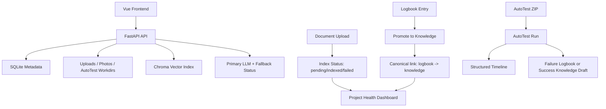

# Knowledge Workspace

Knowledge Workspace is a local-first engineering workspace that combines three product surfaces in one project:

- `Knowledge Workspace`: curated knowledge entries, logbook troubleshooting notes, saved prompts, and related-item links
- `AutoTest`: guarded ZIP / GitHub intake for quick acceptance-style test runs with structured timelines
- `Project Health Dashboard`: real aggregate metrics for knowledge quality, logbook promotion, AutoTest reliability, and document indexing state

## Product Positioning

This repo is built as a portfolio-grade full-stack system rather than a demo CRUD app. The goal is to show:

- consistent data contracts across backend, frontend, and dashboard metrics
- observable background-style workflows with reliable failure states
- testable safety boundaries for file handling and command execution
- clean, auditable architecture with incremental router/service separation

## Core Flow



## Feature Summary

### Knowledge + Logbook

- knowledge lifecycle: `draft -> reviewed -> verified -> archived`
- logbook troubleshooting capture with source refs and related item links
- promote flow now writes the canonical `logbook:{id} -> knowledge:{id}` `produced` link
- compatibility migration keeps old reverse links readable while dashboard metrics use one fixed direction

### AutoTest

- upload `.zip` projects or register GitHub repos for analysis
- simulated mode by default for demos, CI, and safe reproducibility
- real mode is opt-in and uses fixed timeouts, `shell=False`, and sensitive env scrubbing
- run detail includes a timeline with:
  - `Uploaded`
  - `Extracted`
  - `Detected stack`
  - `Installed dependencies / Prepared environment`
  - `Ran tests`
  - `Generated report`
  - `Failed reason`
- any exception after run creation is forced into `failed`, with `failed_reason` persisted

### Project Health Dashboard

- knowledge counts by status
- logbook resolution rate and promoted-to-knowledge count
- AutoTest totals, pass rate, and recent runs
- document counts based on real DB index state:
  - `pending`
  - `indexed`
  - `failed`
  - `archived`

## Security Boundary

AutoTest is intentionally constrained, but it is not a sandbox.

- default mode is `AUTOTEST_MODE=simulated`
- real mode must be explicitly enabled
- subprocess execution uses `shell=False`
- command timeout is fixed via `AUTOTEST_TIMEOUT_SECONDS`
- real mode strips env vars containing:
  - `TOKEN`
  - `KEY`
  - `SECRET`
  - `PASSWORD`
  - `DATABASE_URL`
- ZIP intake rejects unsafe paths, symlinks, overlarge expansion, and excessive file counts

Recommended usage:

- use `simulated` mode in CI, demos, and shared machines
- use `real` mode only on a local or isolated environment you control

## Local Startup

### Prerequisites

- Python `3.11`
- Node.js `20`

### Backend

```bash
cd backend
python -m pip install -r requirements.txt
python -m pip install -r requirements-dev.txt
```

Set environment variables:

```env
JWT_SECRET=<32+ chars>
DEFAULT_OWNER_PASSWORD=<local password>
ALLOWED_ORIGINS=http://localhost:5173
AUTOTEST_MODE=simulated
```

Run:

```bash
cd backend
python -m uvicorn app.main:app --host 127.0.0.1 --port 8000 --reload
```

### Frontend

```bash
cd frontend
npm ci
npm run dev -- --host 127.0.0.1 --port 5173
```

## Test And Verification

### Backend

```bash
cd backend
python -m compileall app
python -m pytest -q
```

### Frontend

```bash
cd frontend
npm ci
npm run lint
npm run build
npm run test:run
```

If your local default Node runtime is newer than `20`, use a Node 20 runtime for frontend lint/test/build to match CI.

## CI

CI lives in [.github/workflows/ci.yml](/D:/git/Knowledge_Workspace/.github/workflows/ci.yml) and currently runs:

1. backend dependency install
2. `ruff`
3. `python -m compileall app`
4. `python -m pytest -q`
5. frontend `npm ci`
6. frontend `npm run test:run`
7. frontend `npm run lint`
8. frontend `npm run typecheck`
9. frontend `npm run build`
10. release packaging and smoke checks

## Dashboard Metric Contract

`GET /api/dashboard/health`

Key guarantees:

- `logbook.promoted_to_knowledge` is counted from canonical `logbook -> knowledge` links
- `documents.indexed`, `documents.pending`, and `documents.failed_documents` come from persisted document index state, not UI inference
- metrics are scoped to the current authenticated user

## AutoTest Modes

### `simulated`

- safest default
- no real dependency install or user project command execution
- stable for CI and screenshots

### `real`

- extracts the ZIP
- detects Node/Python project roots
- runs project commands with constrained subprocess settings
- should only be used on trusted code in an isolated environment

## Known Limitations

- AutoTest is not containerized or VM-isolated
- frontend lint currently passes with warnings; the warnings are style-oriented rather than correctness failures
- Chroma emits third-party deprecation warnings in tests
- GitHub analyze is still an intake flow, not a full remote clone-and-run executor

## Portfolio Case Study

See [docs/PORTFOLIO_CASE_STUDY.md](/D:/git/Knowledge_Workspace/docs/PORTFOLIO_CASE_STUDY.md) for:

- problem framing
- architecture choices
- major bug fixes
- dashboard contract design
- interview demo script
